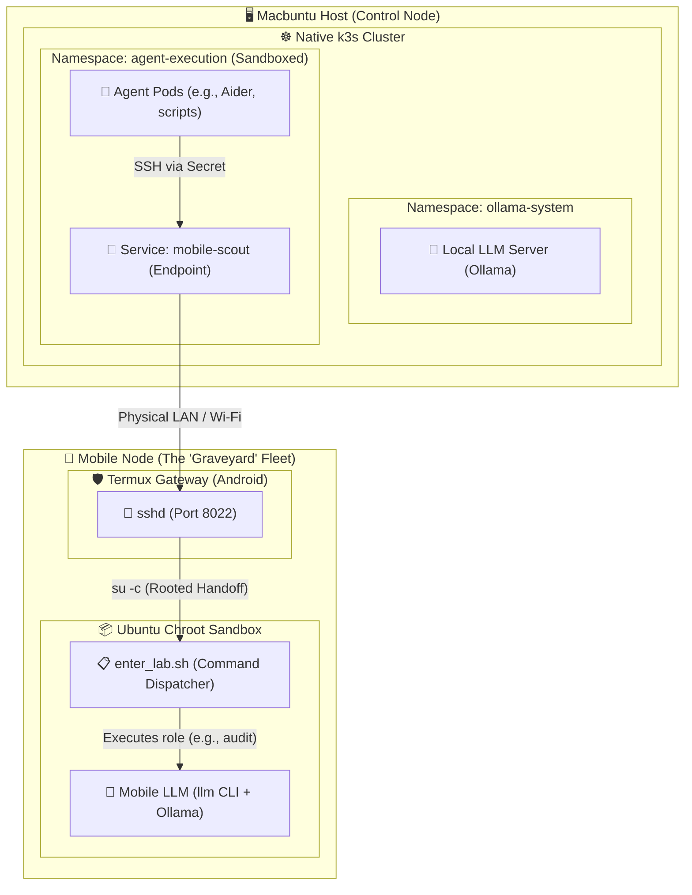

# Private Agent Runtime

This repository contains the infrastructure code for running a local AI cluster using Kubernetes. The goal is to provide a sandboxed environment for executing AI agents with access to a locally hosted LLM.

## Architecture



The setup script and provisioners build the following environment:

- **Kubernetes Cluster**: A native `k3s` installation on the Ubuntu host.
- **Mobile Nodes**: Rooted Android devices bridged into the cluster via `Service` and `Endpoint` configurations (see `/mobile-nodes`).
- **Namespaces**:
  - `ollama-system`: Dedicated namespace for the local LLM inference server.
  - `agent-execution`: A sandboxed namespace for running AI agents.
- **Security**: A `default-deny-egress` network policy is applied to the `agent-execution` namespace to prevent agents from making unauthorized outbound connections.
- **LLM Server**: An Ollama deployment is configured in CPU mode within the `ollama-system` namespace. It is exposed via a LoadBalancer service mapping port `11434` directly to your host's `localhost:11434`.
- **Models**: The environment is optimized for:
  - `qwen2.5:0.5b` (Auditor/Specialist role - very fast)
  - `mistral:7b` (Tech Lead role - much more stable for Aider)
- **Agentic Editor**: Installs [Aider](https://aider.chat/) and [LLM CLI](https://llm.datasette.io/) into a dedicated Python virtual environment and configures them to communicate with the local Ollama instance running inside the cluster.

## Prerequisites

The setup script requires:
- `kubectl`
- `k3s`
- **Python 3.9+**: Aider requires at least Python 3.9. On Ubuntu 20.04, it is recommended to use the `deadsnakes` PPA to install Python 3.9 and map `python3` to it via `update-alternatives`.

## Quick Start

1. Clone this repository and navigate to the directory:
   ```bash
   cd private-agent-runtime
   ```

2. Run the setup script:
   ```bash
   ./setup.sh
   ```

3. Once complete, you can start Aider connected to your local cluster:
   ```bash
   source ~/.venv-private-runtime/bin/activate
   aider --model ollama_chat/mistral
   ```

## Swarm Verification Script (`test-swarm.sh`)

Use the `test-swarm.sh` script to verify the end-to-end functionality of your swarm using different tools and models.

```bash
# Test using LLM CLI with Qwen (fast)
./test-swarm.sh llm qwen2.5:0.5b

# Test using Aider with Mistral (stable)
./test-swarm.sh aider mistral
```

## Mobile Bridge Test (`test-mobile-bridge.py`)

To verify the connection to your mobile nodes from within a sandboxed pod, use the `test-mobile-bridge.py` script. This script uses Kubernetes environment variables to dynamically discover the mobile service and verify the inference path.

```bash
source ~/.venv-private-runtime/bin/activate
python3 swarm-exec.py test-mobile-bridge.py
```

## Serverless Sandbox Executor (`swarm-exec.py`)

For maximum security, this runtime includes a `swarm-exec.py` utility that allows agents to execute generated code inside a transient Kubernetes pod rather than on the host machine.

- **Lifecycle**: Creates a fresh `python:3.12-slim` pod, executes the code, captures logs, and self-destructs.
- **Robustness**: Uses Base64 encoding to pass code into the container, avoiding shell escaping and syntax issues.
- **Example Usage**:
  ```bash
  source ~/.venv-private-runtime/bin/activate
  python3 swarm-exec.py "import platform; print(platform.system())"
  ```

## Security Audit: Egress Control

A "Red Team" exfiltration test was conducted to verify the isolation of the `agent-execution` namespace.

- **Initial Finding**: Default clusters often skip network policy enforcement.
- **The Fix**: The cluster uses the **k3s integrated network policy controller** (enabled by default in native k3s).
- **Refinement**: A custom `manifests/netpol-allow-internal.yaml` is provided to allow internal cluster DNS and mobile node traffic while maintaining a strict "deny-all" for the public internet.
- **Verification**: Post-fix testing with `exfiltration-test.py` confirms that all outbound traffic (including DNS and HTTP) is now correctly blocked by the Kubernetes control plane.

## Gotchas & Caveats (Lessons Learned)

- **NetworkPolicy Support**: Always verify with `exfiltration-test.py` before trusting a "sandboxed" environment.
- **Python Versioning**: Ubuntu 20.04's default Python 3.8 is incompatible with modern Aider versions. Always ensure `python3 --version` returns 3.9+ before running `setup.sh`.
- **Model Loops**: Smaller models (like `qwen2.5:0.5b`) may enter a repetition loop with Aider's complex system prompts. Use `mistral` (7B) for more reliable code generation tasks.
- **Aider Model Naming**: For local Ollama instances, use the `ollama_chat/` prefix (e.g., `ollama_chat/mistral`) and set `OLLAMA_API_BASE="http://localhost:11434"` to ensure proper context window detection and API communication.

## Identity & Auditability

Treat each device as a unique "employee" by setting device-specific Git identities:
- **Macbuntu Box**: `git config --global user.name "Graham (K3s-Agent)"`
- **Moto Edge 23**: `git config --global user.name "Graham (MotoEdge23)"`
- **PH-1 Auditor**: `git config --global user.name "Graham (Auditor-PH1)"`
