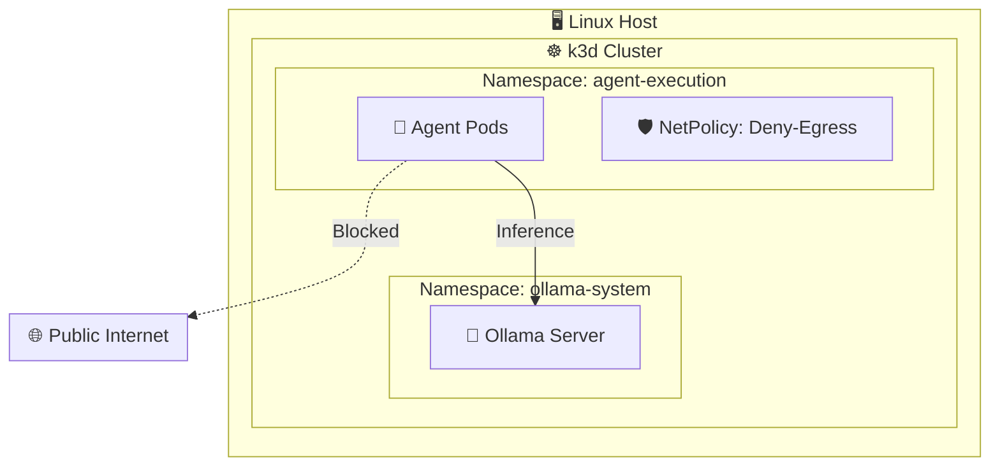
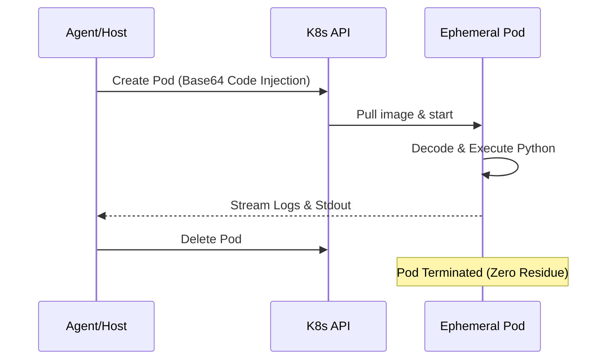
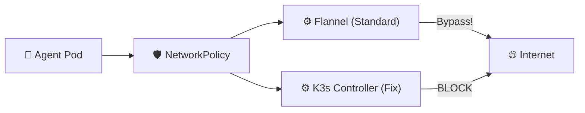
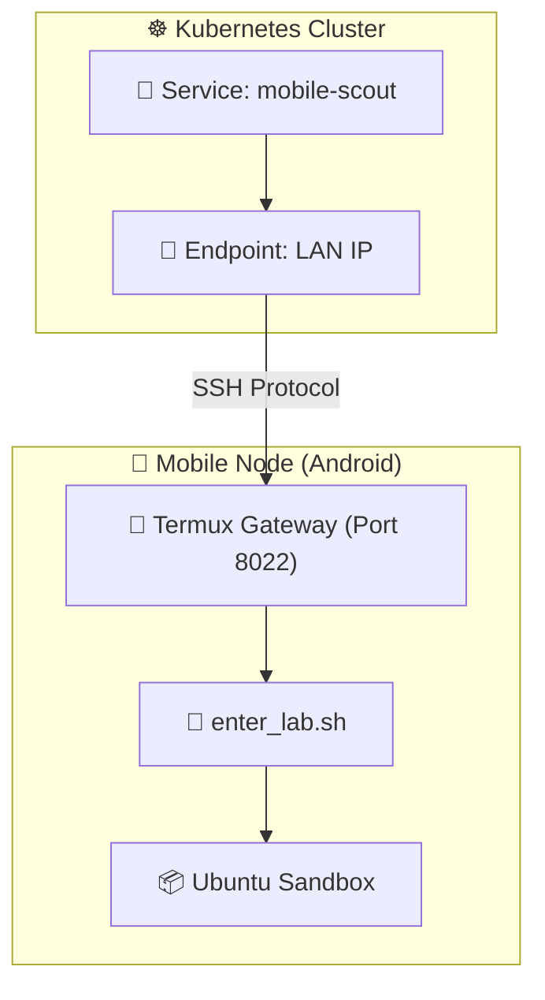

# Building a Private AI Swarm: Lessons from the Front Lines of Local Runtimes

The rise of agentic AI—autonomous systems that can write and execute code—presents a dual challenge: how do we provide these agents with the power they need while ensuring they don't accidentally (or maliciously) compromise our host systems?

This article explores the architecture, hurdles, and outcomes of the **Private Agent Runtime**, a project dedicated to building a secure, locally-hosted Kubernetes cluster for AI agents.

## 1. The Vision: A Secure, Zero-Trust Laboratory

The goal was simple but ambitious: create a "black box" where an AI agent like Aider could live, think, and work. This environment needed to satisfy three requirements:
1.  **Data Sovereignty:** No code or prompts should ever leave the local network.
2.  **Execution Isolation:** Any code the agent generates must run in a transient sandbox, not on the developer's workstation.
3.  **Hardened Egress:** Even if an agent "hallucinates" a curl command to a malicious domain, the network layer must block it.

## 2. Architecture: The Multi-Layered Fortress

The runtime is built on a tiered architecture using **k3d** (a lightweight Kubernetes distribution) running on a Linux host.



### Layer 1: The Orchestration Plane
We used Kubernetes namespaces to enforce strict logical separation:
*   **`ollama-system`**: The "Brain." This namespace houses the Ollama inference server, providing LLM capabilities to the rest of the cluster.
*   **`agent-execution`**: The "Hands." This is a heavily restricted sandbox where agents operate. It is protected by a `default-deny-egress` NetworkPolicy.

### Layer 2: Ephemeral Execution (`swarm-exec.py`)
To prevent "state drift" and ensure security, we developed a utility called `swarm-exec.py`. Instead of letting an agent run code in its own persistent container, the agent sends its Python code to this utility, which:



1.  Spins up a fresh `python:3.12-slim` pod.
2.  Injects the code via Base64 (avoiding shell injection risks).
3.  Executes the code, streams the logs, and immediately destroys the pod.

### Layer 3: Remote Compute Nodes (The "Graveyard" Fleet)
To scale horizontally without buying new hardware, we integrated old, rooted Android devices. Using a **Rooted Chroot Pattern**, these devices run a full Ubuntu userland and are bridged into the Kubernetes cluster as `Service` and `Endpoint` objects, acting as specialized "Security Analyst" or "Audit" nodes.

## 3. Hard-Won Lessons: Troubleshooting the Sandbox

Building this wasn't without its hurdles. Here are the key technical challenges we overcame:

### The NetworkPolicy Illusion
The most critical discovery was that standard `k3d` (using the Flannel CNI) **does not enforce NetworkPolicies by default**. During initial testing, we found that pods in the "sandboxed" namespace could still reach the public internet.



*   **The Fix:** We had to explicitly enable the k3s integrated network policy controller during cluster creation:
    ```bash
    k3d cluster create --k3s-arg "--disable-network-policy=false@server:*"
    ```

### Verified Isolation (The Red Team Test)
To ensure the fix worked, we developed `exfiltration-test.py`. This script attempts to reach common external IPs and DNS servers. Only after this script fails to "phone home" do we consider the runtime ready for agentic work.

### The Python Version Trap
Ubuntu 20.04 (our primary testbed) ships with Python 3.8. However, modern agentic tools like Aider require Python 3.9+. The setup script was updated to handle `update-alternatives` and ensure a compatible virtual environment is created automatically.

### Model Selection: Speed vs. Stability
We found that while `qwen2.5:0.5b` is incredibly fast for small utility tasks, its limited context handling often leads to "repetition loops" when faced with complex system prompts. For reliable coding tasks, the **Mistral 7B** model (running in CPU-optimized mode) proved to be the "minimum viable stability" for the swarm.

## 4. Outcomes and Future Direction

The project successfully delivered a reproducible, one-shot installation script (`setup.sh`) that transforms a standard Linux box into a hardened AI laboratory.

*   **Auditability:** Every node in the swarm (from the host to the mobile phones) has a unique Git identity. When code is committed, we know exactly which "agent" or "phone" performed the work.
*   **Zero-Trust by Default:** By forcing all external calls through a verified sandbox, we can experiment with the latest agentic frameworks without fear.

---

## Appendix: The "Graveyard" Fleet & Mobile Agents

While the primary cluster handles heavy lifting, the **Mobile Nodes** represent a unique extension of the project.



By repurposing old Android hardware (like the PH-1 or Moto Edge 23), we created a distributed "audit" layer. These devices run a hardened dispatcher script called `enter_lab.sh`.

**The Mobile Workflow:**
1.  **Provisioning:** A `provision-mobile-node.sh` script installs the Ubuntu chroot, sets up SSH keys, and registers the phone's LAN IP with the Kubernetes DNS.
2.  **Dispatching:** The host can pipe code directly to a phone via SSH:
    ```bash
    cat logic.py | ssh -p 8022 agent@<PHONE_IP> "sudo ~/enter_lab.sh audit"
    ```
3.  **Future Potential:** While we currently use these for specialized audits, the next phase involves running lightweight, device-resident agents that can monitor the primary cluster's health and security status autonomously.
