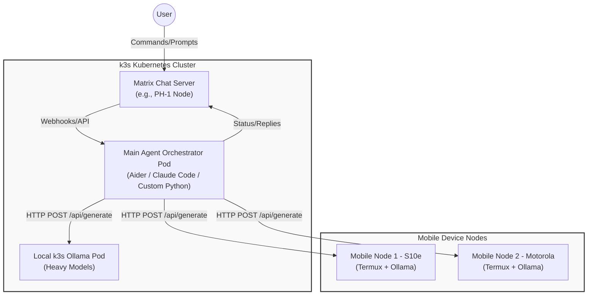

# Agentic Harness & Orchestration Specification (APP-002)

## 1. Overview & Objective
The goal of this specification is to define the architecture for the primary agentic harness within the private lab environment. Moving away from direct SSH-based execution, this setup utilizes standard HTTP APIs for model interaction.

The architecture centralizes the "brain" (the Main Agent Orchestrator) inside the k3s cluster, which receives commands via Matrix chat. The agent then delegates inference tasks to a distributed fleet of Ollama servers running on both the k3s cluster and mobile nodes.

## 2. Architecture Diagram

## 3. Component Breakdown

### A. The Control Plane: Matrix Chat
- **Role:** The primary user interface. Allows the user to issue commands from anywhere without needing direct terminal access.
- **Implementation:** Matrix Homeserver (Conduit) running on the Essential PH-1 (as per APP-001).
- **Integration:** The Main Agent listens for events in specific Matrix rooms using a Matrix bot SDK.

### B. The Orchestrator: Main Agent (k3s)
- **Role:** Parses user intent from Matrix, plans tasks, and acts as the router to the inference nodes. It holds the context window and memory.
- **Implementation:** Runs as a persistent Deployment or StatefulSet inside the k3s cluster.
- **Tooling Choice:** A custom Python agent (e.g., using `langchain` or `litellm` for unified API routing) or a wrapped version of Aider configured to operate non-interactively via HTTP event triggers.
- **State:** Maintains conversation history and workspace context.

### C. The Inference Fleet (LLM APIs)
All nodes expose the standard Ollama REST API (`http://<NODE_IP>:11434/api/generate` or `/api/chat`).
- **k3s Ollama Node:** Handles complex reasoning or larger parameter models (e.g., Mistral/Llama 3 8B) that require standard x86/server hardware.
- **Mobile Nodes (S10e, Motorola):** Act as specialized inference workers. They can run smaller, quantized models (e.g., Phi-3, Qwen 1.5B). The main agent can route simpler tasks (like summarization or data extraction) to these nodes to offload the main k3s server.

## 4. Communication Flow & Network

1. **User Input:** User types a message in the Matrix client: `"Review the k3s-check.sh script and summarize issues."`
2. **Event Trigger:** The Main Agent (Matrix Bot) receives the message payload.
3. **Routing Decision:** The Agent determines the required capability. It decides a smaller model can handle the summarization.
4. **HTTP API Call:** The Agent sends an HTTP POST request to `http://<Mobile_Node_IP>:11434/api/chat` with the script contents.
5. **Execution:** The mobile node processes the prompt and streams the JSON response back.
6. **Response Delivery:** The Main Agent formats the API response and posts it back to the Matrix room.

## 5. Next Steps for Implementation
1. **Agent Containerization:** Write a `Dockerfile` for the Main Agent bot that includes Matrix SDKs and HTTP request libraries.
2. **Network Validation:** Ensure the k3s Pod network can successfully curl the `11434` ports on the external mobile node IP addresses (may require updating `netpol-allow-internal.yaml`).
3. **Bot Provisioning:** Create the Matrix account for the bot and set up the access tokens as Kubernetes Secrets.
